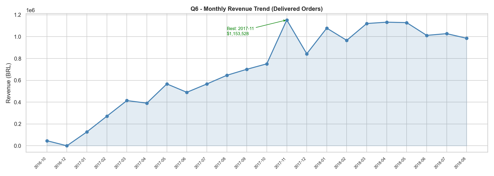
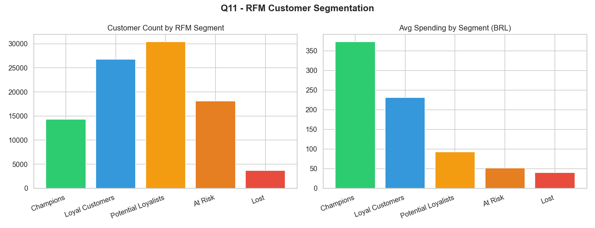
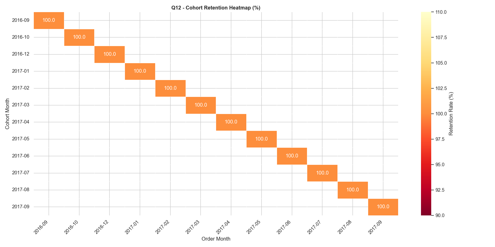
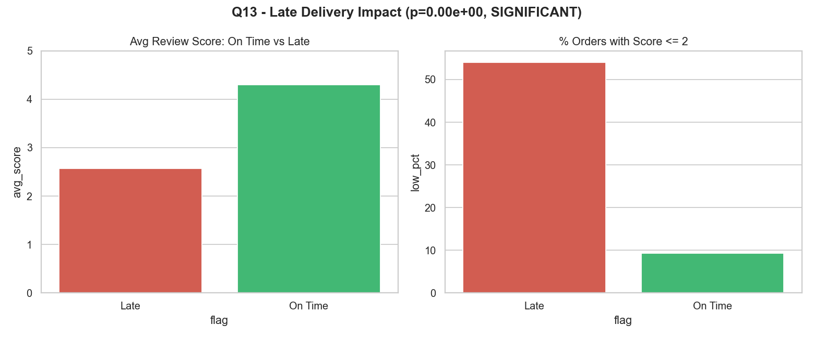

# Olist E-Commerce Analytics — SQL + Python

> End-to-end business analytics on a real Brazilian e-commerce dataset.
> 30 business questions across 3 difficulty levels, answered with SQL and visualized with Python.

---

## Dataset

[Olist Brazilian E-Commerce Public Dataset](https://www.kaggle.com/datasets/olistbr/brazilian-ecommerce) — Kaggle
**~100,000 orders | 9 relational tables | 2016–2018**

| Table | Description |
|-------|-------------|
| `orders` | Order lifecycle and timestamps |
| `order_items` | Products, prices, sellers per order |
| `order_payments` | Payment type and value |
| `order_reviews` | Customer review scores and comments |
| `customers` | Customer location data |
| `products` | Product dimensions and category |
| `sellers` | Seller location data |
| `geolocation` | Brazilian zip code coordinates |
| `product_category_name_translation` | PT → EN category names |

---

## Project Structure

```
olist-ecommerce-analytics/
├── sql/
│   ├── 01_basic.sql          # Q1–Q10  — GROUP BY, JOIN, DISTINCT, subquery, UNION
│   ├── 02_intermediate.sql   # Q11–Q20 — CTE, window functions, ROW_NUMBER, LEAD, moving avg
│   └── 03_advanced.sql       # Q21–Q30 — RFM, cohort, duplicate detection, gaps & islands, CLV
├── notebooks/
│   ├── 00_setup.ipynb        # Download data + build SQLite DB
│   ├── 01_basic_analysis.ipynb
│   ├── 02_intermediate_analysis.ipynb
│   └── 03_advanced_analysis.ipynb
├── src/
│   └── db_utils.py           # SQLite connection + query helpers
└── requirements.txt
```

---

## 30 Business Questions

### Basic — `GROUP BY · JOIN · DISTINCT · LEFT JOIN · HAVING · Subquery · UNION`

| # | Business Question | SQL Concept |
|---|-------------------|-------------|
| Q1 | What are the top product categories by order volume? | `GROUP BY`, `ORDER BY` |
| Q2 | What is the distribution of order statuses? | `GROUP BY`, window `COUNT` |
| Q3 | Which Brazilian states have the most customers? | `COUNT DISTINCT`, `GROUP BY` |
| Q4 | How does average order value vary by payment type? | `AVG`, `SUM`, `GROUP BY` |
| Q5 | Which categories have the highest customer review scores? | Multi-table `JOIN`, `HAVING` |
| Q6 | How many customers are repeat buyers? | `DISTINCT` + scalar subquery |
| Q7 | What percentage of orders are missing a review? | `LEFT JOIN`, `NULL` check |
| Q8 | Which categories have both high volume AND high satisfaction? | `HAVING` with multiple conditions |
| Q9 | Which products are priced above their category average? | Correlated subquery |
| Q10 | Which states appear as both customer and seller locations? | `UNION ALL`, `IN` subquery |

### Intermediate — `CTE · RANK · DENSE_RANK · ROW_NUMBER · LEAD · Cumulative Sum · Moving Average`

| # | Business Question | SQL Concept |
|---|-------------------|-------------|
| Q11 | What does monthly revenue look like — best and worst months? | `CTE`, `RANK()` |
| Q12 | How does actual delivery time compare to estimated? | `JULIANDAY`, `CASE WHEN` |
| Q13 | What are the top 3 best-selling products in each category? | `RANK()`, `PARTITION BY` |
| Q14 | Do the top 10% of sellers drive a disproportionate share of revenue? | `NTILE()`, `CTE` |
| Q15 | Do customers order more on weekdays or weekends? | `STRFTIME`, window `COUNT` |
| Q16 | What is the first order for each customer? (deduplication) | `ROW_NUMBER()` |
| Q17 | What is the difference between RANK and DENSE_RANK? | `RANK()` vs `DENSE_RANK()` |
| Q18 | What does cumulative revenue look like over time? | `SUM() OVER (ORDER BY)` |
| Q19 | How does each month's revenue compare to the next month? | `LEAD()` |
| Q20 | What is the 3-month moving average of order volume? | `AVG() OVER (ROWS BETWEEN)` |

### Advanced — `RFM · Cohort · Gaps & Islands · YoY · Pivot · CLV · Duplicate Detection`

| # | Business Question | SQL Concept |
|---|-------------------|-------------|
| Q21 | How can we segment customers using RFM scoring? | `CTE` chain, `NTILE`, `CASE WHEN` |
| Q22 | What does customer retention look like across monthly cohorts? | Cohort `CTE`, `JOIN` |
| Q23 | Does late delivery significantly impact review scores? | `CASE WHEN`, Python t-test |
| Q24 | How can we rank sellers using a composite performance score? | `NTILE`, weighted scoring |
| Q25 | Which product categories show the strongest MoM revenue growth? | `LAG()`, `PARTITION BY` |
| Q26 | Which orders have duplicate reviews? How do we clean them? | `ROW_NUMBER` deduplication |
| Q27 | Which customers churned (60+ day gap) and came back? | Gaps & Islands, `LAG()` |
| Q28 | What is the year-over-year revenue growth by category? | `LAG()`, YoY pattern |
| Q29 | How does payment method usage break down by month? (pivot) | Conditional aggregation, `CASE` pivot |
| Q30 | Who are the highest-value customers by lifetime value score? | Multi-CTE, CLV, `NTILE` |

---

## SQL Techniques Demonstrated

| Technique | Questions |
|-----------|-----------|
| `GROUP BY` + `ORDER BY` + `HAVING` | Q1–Q5, Q8 |
| Multi-table `JOIN` | Q1, Q5, Q12, Q21–Q25 |
| `LEFT JOIN` + `NULL` check | Q7 |
| `DISTINCT` | Q3, Q6 |
| Scalar / correlated subquery | Q6, Q9, Q10 |
| `UNION` / `UNION ALL` | Q10 |
| `CASE WHEN` | Q2, Q15, Q23, Q29 |
| `CTE` (Common Table Expressions) | Q11, Q14, Q16–Q30 |
| `RANK()` | Q11, Q13 |
| `DENSE_RANK()` | Q17 |
| `ROW_NUMBER()` | Q16, Q26 |
| `NTILE()` | Q14, Q21, Q24, Q30 |
| `LAG()` | Q25, Q27, Q28 |
| `LEAD()` | Q19 |
| `SUM() OVER` (cumulative) | Q18 |
| `AVG() OVER ROWS BETWEEN` (moving avg) | Q20 |
| `JULIANDAY()` date arithmetic | Q12, Q22, Q27, Q30 |
| `STRFTIME()` date formatting | Q11, Q15, Q22, Q25 |
| Conditional aggregation (SQL pivot) | Q29 |
| Gaps & Islands pattern | Q27 |
| YoY comparison pattern | Q28 |
| Customer Lifetime Value | Q30 |
| Statistical significance test (Python) | Q23 |

---

## Tech Stack


---

## How to Run

```bash
# 1. Clone the repo
git clone https://github.com/sualpsudas/olist-ecommerce-analytics.git
cd olist-ecommerce-analytics

# 2. Install dependencies
pip install -r requirements.txt

# 3. Set up Kaggle API token
# Download kaggle.json from kaggle.com/settings and place at ~/.kaggle/kaggle.json

# 4. Build the database (run once)
jupyter notebook notebooks/00_setup.ipynb

# 5. Open any analysis notebook
jupyter notebook notebooks/01_basic_analysis.ipynb
```

---

## Key Insights

- **Top category:** `bed_bath_table` leads with the highest order volume across all categories
- **Order fulfillment:** 96.5% of orders are successfully delivered
- **Revenue peak:** November 2017 was the best month ($1,153,528) — likely Black Friday effect
- **Delivery performance:** Orders arrive **11.2 days earlier** than estimated on average (actual: 12.6d vs estimated: 23.7d)
- **Payment preference:** Credit card dominates both in volume and total revenue
- **Seller concentration:** Top 10% of sellers generate **67.6% of total revenue** (strong Pareto effect)
- **Weekend orders:** 23% of all orders are placed on weekends vs 77% on weekdays
- **RFM segmentation:** 14,311 Champions identified vs 3,697 Lost customers
- **Late delivery impact:** Statistically significant — On Time avg: **4.29** vs Late avg: **2.57** (p < 0.0001)
- **Fastest growing category:** `fashion_bags_accessories` +15,239% MoM growth in Jan 2017

---

## Sample Visualizations

### Monthly Revenue Trend (Q11)


### RFM Customer Segmentation (Q21)


### Cohort Retention Heatmap (Q22)


### Late Delivery Impact on Review Scores (Q23)


---

*Dataset: [Olist @ Kaggle](https://www.kaggle.com/datasets/olistbr/brazilian-ecommerce) — licensed under CC BY-NC-SA 4.0*
